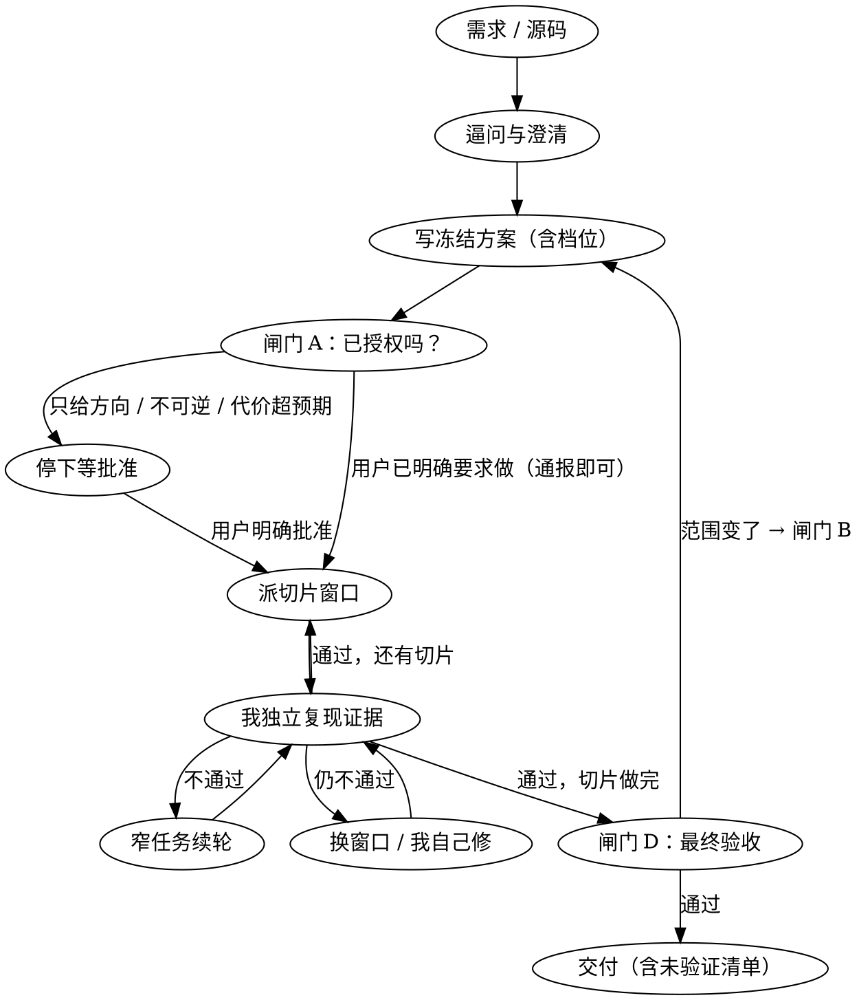

# orchestrated-build — 委托式构建

把"大工程交给工人做、但正确性由我兜底"固化成可重复的流程。

**核心原则：工人的自述不是证据，我复现出来的输出才是。**

## 三条纪律（其余都是它们的展开）

1. **开工前冻结方案，让用户批准。** 没有它，用户会在中途打断，已完成的工作作废。
2. **派活时规格自包含。** 工人只读四样：工人合同 + 仓库内契约 + 本轮指令 + 上一窗口交接。规格里出现"去参考一下那个项目"，说明我还没想清楚。
3. **验收由我亲自复现。** 复跑门禁、抽查实现、对核心不变量自己写反例。**测试全绿 ≠ 能用。**

## 何时使用

**用**：任务超出一个上下文；要把实现交给别的 agent / 进程 / 会话；从零写程序或大规模重写；含不可逆操作（删数据、改 schema、发布）；需要向他人解释"为什么这么定"。

**不用**：单文件小改动；纯只读调研；一次能做完、自己能验的任务——**直接做，别上流程**。

> **实测边界**：一个"10 分钟内做完"的小工具（规格里有若干未定项），不走流程的那一路 4 分半交付了带 19 个测试的可用实现；走流程的那一路正确地停在闸门、**一行代码都没写**。
> **判据不是规模，也不是规格是否明确，而是"方案做错的代价是否大于闸门的时间"。**

## 主循环

**第一步是逼问与澄清**：把需求里每个"可有两种以上合理解释"的点列成一张开放问题表（`未定项 / 我的建议 / 代价`），用户只需点头或改一条。实测里基线最典型的失败不是做得差，而是**一次都没向用户澄清**（全靠假设默认值）。

**档位（lite / heavy）在闸门 A 上和用户一起定**，不得自设。它只决定文档密度与验收强度——**两档共用同一个主循环**。判据见 `templates/freeze-plan.md §0`。

## 闸门

| 级别 | 何时 | 产出 | 问用户？ |
|---|---|---|---|
| **A 方案冻结** | 开工前一次 | 冻结方案（含档位 / 开放问题 / **本机无法验证清单**） | 见下 |
| **B 变更** | 范围或架构变更 | ADR + **作废清单 + 代价核算** | **必须** |
| **C 切片完成** | 每片收尾 | 验收记录（我跑出的真实输出） | 不问（除非触及不可逆或用户可见契约） |
| **D 最终验收** | 收尾 | 全量门禁输出 + **未验证清单逐条交付** | **必须** |

**闸门 A 有两种形态**——不区分会导致两种坏结果：把常规实现也卡住、或把沉默当同意。

- 用户**已明确要求**做（"帮我做 X"）⇒ **通报**：写冻结方案 → 继续推进，方案可随时叫停。
- 只给方向（"看看该怎么做"）/ 含**不可逆操作** / 代价明显超预期 ⇒ **停下等**，直到用户明确说"按这个做"。

**沉默不是同意。** "追问一次没回复就按默认方案开工"等于把计时器当授权——本 skill 曾写错这一条。

自己是被派来的工人、无人可问时，**派活指令本身就是授权**：它说"先给方案"就只写方案并停下，说"把东西做出来"就按最小档位推进并在交付物首段声明。

## 文件

| 路径 | 内容 |
|---|---|
| `references/gates.md` | 四级闸门工件与判据 · 规格自检 · **记录系统**（目录布局 / 文档角色 / 每份必含的节） |
| `references/delegation.md` | 生产型 / 隔离型委托 · 窗口可靠性 · 换工具要改什么 |
| `references/verification.md` | 证据规则 · 抽查 · 反例设计 · 退回协议 |
| `references/pitfalls.md` | 通用陷阱库（**本 skill 唯一能自我进化的地方**） |
| `templates/` | 冻结方案 · 切片指令（**内嵌交接模板**） · 工人合同 · 验收记录 |
| `scripts/` | 一份 omp 驱动器实现（**协议与工具无关**；语义要求见 `delegation.md`） |

## 写什么、不写什么（**本 skill 最重要的设计约束**）

**写纪律与工件，不写战术判断。**

- **该写**："**没有外部强制就不会做**"的事——冻结闸门、缺口表带"何时补"、验收只由命令输出填充、产物是线索不是证据。
- **不该写**：战术判断（该不该派子代理、怎么切分任务、要不要写脚本）。能力强的模型自己会算，**写死会反噬**——实测：给"隔离能省上下文"加了规则却没写成本门槛，下一轮受试者拿它处理一个 20 行探测就能解决的问题，耗时从 46 秒变成 25 分钟。

**加一条规则前先问**：如果没有这条，一个能干的 agent 会因为**不知道**而做错，还是因为**没被要求**而跳过？

- 前者是**知识** → 写进 `references/pitfalls.md`（一行即可），不要写成规则。
- 后者才是**纪律** → 值得写成规则。

**同一规则只允许一处权威，别处只引用、不复制清单。** 复制必然漂移——本 skill 自己反复踩：同一份数同时写成 3 份和 4 份、段数写成 6 和 7、旧规则在正文改了但副本没跟上。

## 实际效果与自我进化

**一次**真实运行（Go→Rust 重写：18 窗口 / 20 轮 / 0 次退回 / 431 测试；7 个真实缺陷被拦下，其中 3 个是设计阶段拦的）+ **四轮**对照测试。

⚠ **这不是"照做就能成功"的证据**：样本量小、同一模型、**触发精度未验证**，且其中一次试跑自身就没达到本文档要求的完整性。作用域见 `VALIDATION.md`。

**自我进化**：唯一入口是 `references/pitfalls.md`。每次收尾时，把工人交接文档「陷阱」段里**跨项目可复用**的条目搬进去，按类别追加。判据：换个项目还会踩 ⇒ 入库；项目专属 ⇒ 留在该项目的交接文档里。
