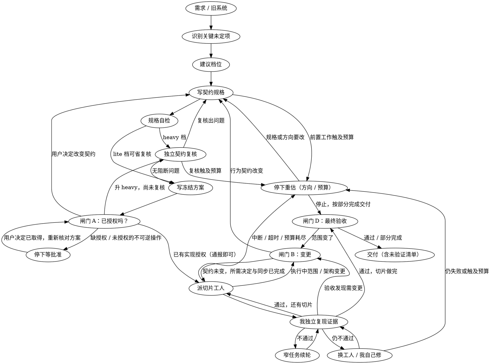

# orchestrated-build — 委托式构建

**核心原则：工人的自述不能代替证据；关键验收结论由我独立核对并复现。**

本文的子代理工具示例基于 OMP；在其他环境中使用时，按续接、审计与隔离等能力映射到实际可用的工具，不假定 `task` / `hub` / `history://` 存在。缺少等价审计能力时如实列为未验证。

## 三条纪律（其余都是它们的展开）

1. **派实现工人前写冻结方案。** 已有实现授权则**通报并推进**；缺少授权、或涉及未授权的不可逆操作，才**停下等批准**。
2. **派活前我自己产出契约规格，并让规格自包含。** 工人依据仓库工程约定 + **仓库内契约** + 本轮指令 + 上一轮交接（若有）实现；材料读取边界见 `templates/AGENTS.md §1`。契约的完整性由我负责。
3. **验收由我亲自复现。** 复跑门禁、抽查实现，按 `references/verification.md` 的风险要求验证不变量。**测试全绿 ≠ 能用。**

## 何时使用

**用**：需要委托实现或跨上下文交接，且方案错误的代价足以承担契约、记录与验收成本。高风险重写、跨模块开发属于典型场景；仅有不可逆操作或需要解释决策，不自动触发整套委托流程。

**不用**：低风险小改动；纯只读调研；错误代价不足以承担流程成本的实现。

> **判据是代价，不是规模，也不是规格是否明确**：比较错误造成的返工与损失，和流程耗时及资源成本。已有授权的闸门不要求等待。同一条判据也决定档位。

## 主循环

```dot
digraph loop {
  "需求 / 旧系统" -> "识别关键未定项";
  "识别关键未定项" -> "建议档位";
  "建议档位" -> "写契约规格";
  "写契约规格" -> "规格自检";
  "规格自检" -> "独立契约复核" [label="heavy 档"];
  "规格自检" -> "写冻结方案" [label="lite 档可省复核"];
  "独立契约复核" -> "写冻结方案" [label="无阻断问题"];
  "独立契约复核" -> "写契约规格" [label="复核出问题"];
  "写冻结方案" -> "闸门 A：已授权吗？";
  "闸门 A：已授权吗？" -> "写契约规格" [label="用户决定改变契约"];
  "闸门 A：已授权吗？" -> "独立契约复核" [label="升 heavy，尚未复核"];
  "闸门 A：已授权吗？" -> "停下等批准" [label="缺授权 / 未授权的不可逆操作"];
  "停下等批准" -> "闸门 A：已授权吗？" [label="用户决定已取得，重新核对方案"];
  "闸门 A：已授权吗？" -> "派切片工人" [label="已有实现授权（通报即可）"];
  "派切片工人" -> "我独立复现证据";
  "派切片工人" -> "闸门 B：变更" [label="执行中范围 / 架构变更"];
  "我独立复现证据" -> "窄任务续轮" [label="不通过"];
  "窄任务续轮" -> "我独立复现证据";
  "我独立复现证据" -> "换工人 / 我自己修" [label="仍不通过"];
  "换工人 / 我自己修" -> "我独立复现证据";
  "换工人 / 我自己修" -> "停下重估（方向 / 预算）" [label="仍失败或触及预算"];
  "写契约规格" -> "停下重估（方向 / 预算）" [label="前置工作触及预算"];
  "独立契约复核" -> "停下重估（方向 / 预算）" [label="复核触及预算"];
  "派切片工人" -> "停下重估（方向 / 预算）" [label="中断 / 超时 / 预算耗尽"];
  "停下重估（方向 / 预算）" -> "写契约规格" [label="规格或方向要改"];
  "停下重估（方向 / 预算）" -> "闸门 D：最终验收" [label="停止，按部分完成交付"];
  "我独立复现证据" -> "派切片工人" [label="通过，还有切片"];
  "我独立复现证据" -> "闸门 D：最终验收" [label="通过，切片做完"];
  "我独立复现证据" -> "闸门 B：变更" [label="验收发现需变更"];
  "闸门 D：最终验收" -> "闸门 B：变更" [label="范围变了"];
  "闸门 B：变更" -> "写契约规格" [label="行为契约改变"];
  "闸门 B：变更" -> "派切片工人" [label="契约未变，所需决定与同步已完成"];
  "闸门 D：最终验收" -> "交付（含未验证清单）" [label="通过 / 部分完成"];
}
```

**先识别关键未定项**：只把影响行为、兼容性、成本或权限的歧义列入开放问题表（`未定项 / 我的建议 / 代价`）。需要用户决定的事项先澄清；可逆的内部选择按仓库惯例或最小做法推进并记录。等待关键答案时可继续不依赖它的工作。

## 契约规格（工人唯一的行为判据）

落盘在 `docs/<契约>.md`。**必须在派活之前由我产出**。

来源按情况分：

| 情形 | 契约从哪来 | 要点 |
|---|---|---|
| **从零构建** | 需求澄清的结论 | 每条决策落成**可判定的行为描述**，不是愿望 |
| **重构 / 重写** | **从旧系统提取** | 旧行为里的错误与妥协逐条裁决（保留 / 修正 / 废弃）并给出理由。行为改进须在用户授权范围内；以保持行为为目标的重构，不能借机改变兼容性承诺 |

契约必含：**编号的不变量**（验证证据按编号关联）、**失败分类**、**类型决策**（`Option` 还是必填、谁负责归一化）。不适用的项注明理由。

**契约是行为实现标准**；冲突与未覆盖细节的处理见 `templates/AGENTS.md §1`。我负责在授权范围内裁决，修订契约或实现，并按闸门 B 同步受影响工作。

**材料读取范围在冻结方案 §3 登记，并逐轮写进指令**；任务类型的默认边界见 `templates/AGENTS.md §1`。旧项目重写的读取例外由我判断，仅在补契约仍不足以完成任务、读取确有必要时预先限定路径；工人报行为缺口，由我补契约或修订后续指令。

主循环里的**独立契约复核**按 `references/gates.md`「独立契约复核」执行。

**没写契约也能派活、也能验收通过**——直到某个工人按最小做法猜错了一条没人写下来的规则。`references/gates.md` 的「规格自检」针对的就是它。

## 闸门

| 级别 | 何时 | 产出 | 要用户决定吗？ |
|---|---|---|---|
| **A 方案冻结** | 开工前一次 | 冻结方案（含档位 / 开放问题 / **本机无法验证清单**） | **缺授权 / 未授权的不可逆操作 ⇒ 是**；已有实现授权 ⇒ 通报即可 |
| **B 变更** | 范围或架构变更 | ADR + **作废清单 + 代价核算** | **只有影响用户承诺 / 成本 / 权限的变更才要** |
| **C 切片收尾** | 每片收尾 | 验收记录 + 按风险复跑门禁（见 `references/verification.md`） | 已授权范围内不问 |
| **D 最终验收** | 收尾 | **交付验收结果** + 未验证清单逐条 + 完成 / 部分完成的判定 | 不问——D 是**交付**，不是再等一次批准 |

**闸门 A 的判据**：

- 用户**已明确要求**做（"帮我做 X"）⇒ **通报**：写冻结方案 → 继续推进，方案可随时叫停。
- **缺少实现授权**（只给方向："看看该怎么做"）/ 含**未授权的不可逆操作** / 代价明显超预算 ⇒ **停下等**，直到用户明确说"按这个做"。

**沉默不是同意。** 追问一次没回复就按默认方案开工，等于把计时器当授权。

**我按风险建议档位并说明理由，已有实现授权就按建议推进，用户可调整。** 若所需投入明显超出用户预算，先取得决定。档位变化后的补审与重验见 `references/gates.md`「独立契约复核」与「闸门 C」。

自己是被派来的工人、无人可问时，**派活指令本身就是授权**：它说"先给方案"就只写方案并停下，说"把东西做出来"就按建议档位推进并在交付物首段声明。

## 档位（唯一定义在本表；别处只引用，不重复份数）

先按「何时使用」的成本判据决定要不要走流程，再按下表定档。

| | lite | heavy |
|---|---|---|
| **适用** | 行为与依赖边界清楚，做错的代价局部可控 | 数据损失、权限、发布等高风险操作，或变更影响难以局部验证的跨模块行为 |
| **文档** | 契约 + 冻结方案 + 合并总纲 + 交接（总纲内容见 `references/gates.md`） | 上述记录按角色拆开，另存派工协议与流水（布局及内容见 `references/gates.md`） |
| **验收** | 两档都由我复跑、抽查并按风险验证不变量；门禁范围与证据要求统一见 `references/verification.md` | 同左，切片记录分别存档 |

> **两个边界情形**：
> - **文件少但代价高**（2 个文件的支付舍入逻辑、schema 迁移）⇒ 按代价走 **heavy**。
> - **只做 1 片**⇒ 仍要保留台账与缺口信息；lite 可并入总纲，不必各建一个文件。

**两档共用同一个主循环**，档位只决定文档密度与验收强度。

## 文件

| 路径 | 内容 |
|---|---|
| `references/gates.md` | 写规格、冻结方案、处理变更与收尾时读；含闸门、契约复核与记录布局 |
| `references/delegation.md` | 派工、续接、换人或安排并行时读 |
| `references/verification.md` | 定验收标准、验收或退回时读 |
| `references/pitfalls.md` | 遇到相应问题、技术栈或收集陷阱时读，按类别定位 |
| `templates/` | 产出对应工件时读：冻结方案 · 切片指令（内嵌交接模板）· 工人合同 · 验收记录 |
| `VALIDATION.md` | 验证证据 + 维护说明（**只在你要改这个 skill 时读**） |

## 收尾与自我进化

**每次收尾时**，按 `references/pitfalls.md` 开头的入库判据筛选工人交接中的陷阱。先留在项目交接中；本次任务包含 skill 维护时才更新技能库，其余情况交付候选条目。
